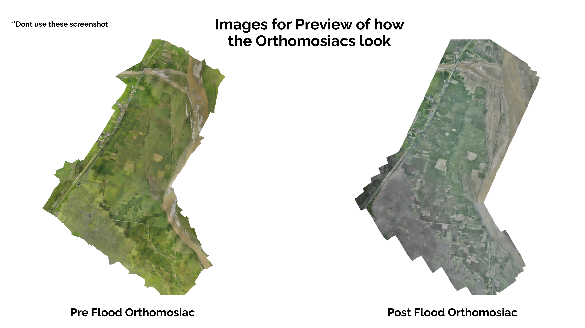

# 🌊 Post–Flood Damage Cutouts Challenge

This challenge is the entry step for our Nepal AI & Computer Vision Bootcamp. Using pre- and post-flood orthomosaics, you'll highlight damaged land and measure affected area. The goal is simple: find flooded land so communities can plan lost land recovery, collect insurance evidence, and build future resilience. Demonstrating how AI models can support disaster recovery and agricultural resilience across the Valley.


## 🎯 Challenge v v v

**Task:** Find land that changed due to flooding and measure how much.

**Input:** Two image sets of the same place — **pre-flood** and **post-flood** orthomosaics.

**Output table:** For each affected region, give **coordinates** (the **center** of the land area) and **area lost (m²)**.

**Or, in short:** Use pre/post flood orthomosaics to segment flood-affected land and output a table of affected regions with **centroid coordinates + area (m²)**.

**Freedom:** Any method (classical CV, U-Net/DeepLab/SegFormer, SAM, thresholding). Any tools: Python, OpenCV, PyTorch/TF, QGIS—your choice. Pretrained or quick train—no restriction.


### 💡If you have access to AI and can Vibe Code dont shy on using them, can give brownie points

---
> [!IMPORTANT]
> **This challenge is not a test of what you know—it's a window into how you work.** Any submission, even partial work or exploratory attempts, is valuable. We want to see your existing skills in action: how you approach problems, what tools you reach for, and how you apply your current knowledge to real-world challenges. Don't hesitate to submit even if your solution is incomplete—effort and thinking process matter more than perfect results.
---


## 📊 Data

* **Small sample (for just an idea and a glance):**



* **Full orthomosaics (Google Drive):**

  * Pre-flood: **[[Drive link – pre]](https://drive.google.com/file/d/1by9yXKye9QkaN9dAqWnMJkNglG9AD3rM/view?usp=sharing)**
  * Post-flood: **[[Drive link – post]](https://drive.google.com/file/d/1x8VdZBs25F9EkWnJw1XR4xnUfBHn0eyY/view?usp=sharing)**

> Tip: You can also use a small portion of both the orthomosiac

---

## 📸 Understanding the Data & Approach

**What you're working with:**

The images provided are **TIFF (Tagged Image File Format)** orthomosaics—georeferenced aerial images stitched together from hundreds of drone photos. Unlike regular JPEGs or PNGs you might work with daily, these are **massive, high-resolution files** often spanning several gigabytes. A single orthomosaic can cover entire valleys with centimeter-level detail, capturing every road, field, building, and water body.

**Why TIFF?** This format preserves geospatial metadata (coordinates, projection systems, pixel resolution) and supports lossless compression, making it the standard for GIS and remote sensing work. Each pixel in these images corresponds to a real-world location with latitude/longitude coordinates—critical for generating accurate area measurements and coordinates.

**The challenge of scale:**

You cannot simply load these images into memory and run a basic script. A full orthomosaic might be 50,000 x 100,000 pixels or larger, requiring smart handling: tiling the image into smaller patches, processing in batches, or using libraries like `rasterio` and `gdal` designed for geospatial rasters. Even viewing the full image requires tools like QGIS or specialized viewers.

**Where AI and segmentation come in:**

Your core task is **change detection**—identifying which areas transformed from dry land to water/flood damage between the two time periods. This requires:

1. **Image Segmentation Models:** You'll likely use semantic segmentation architectures (U-Net, DeepLabV3, SegFormer, or Segment Anything Model) to classify each pixel as "land," "water," "vegetation," or "flood-affected." Pre-trained models on satellite/aerial imagery (like those trained on SpaceNet, xBD disaster datasets, or Sentinel-2 data) can be fine-tuned or used directly.

2. **Change Detection Algorithms:** Compare pre-flood and post-flood segmentation masks to identify regions where land turned into water. Classical approaches (thresholding NDVI/NDWI indices, color differencing) can work but often lack precision. Deep learning change detection methods (Siamese networks, U-Net++ variants) excel here by learning spatial-temporal patterns.

3. **Geospatial Processing:** Convert segmentation outputs (pixel masks) into geographic coordinates and real-world area measurements (m²). Tools like `rasterio`, `shapely`, and `geopandas` help extract polygon centroids and calculate areas using the image's coordinate reference system.

**Your workflow might look like:**

- Load TIFF files and inspect metadata for pixel size.
- Tile large images into manageable chunks.
- Run an AI model of your choice (pre-trained or quickly trained on a small labeled sample) on each tile.
- Post-process masks: identify changed regions.
- Compute centroids (center coordinates) and areas (m²) for each affected region.
- Output results to CSV with geospatial coordinates.

**Start small, validate your approach, then scale up.**

--

## 📤 Submissions

1. On GitHub, **Fork** this repo (top-right ➜ Fork).
2. **Clone** your fork locally: `git clone https://github.com/<you>/<repo>.git && cd <repo>`
3. **Create branch:** `git checkout -b submit/<github_handle>`
4. **Make your folder:** `mkdir -p submissions/<github_handle>/cutouts`
5. Run your code to generate **cutouts** and **affected.csv** into that folder. Add a **README.md**, **requirements.txt**.
6. **Commit & push:**

   ```
   git add submissions/<github_handle>
   git commit -m "Submission"
   git push origin submit/<github_handle>
   ```
7. On GitHub, open a **Pull Request** from your branch to this repo.
8. **PR title:** `[SUBMISSION] <Full Name> (<github_handle>)`.

If you are not familiar with GitHub, in the Flood-seg (Google Drive) -> please make a new folder in the folder **[Submissions](https://drive.google.com/drive/folders/12szwpZg5XQ7ZnWQwGk8XrHqbOrhPqZzR?usp=sharing)** with your name — for example submissions/snehalraj_chugh/ — and upload your cutouts, affected.csv, README, and code files there.


--

## ✅ Deliverables to be looked on

### 1) CSV (one row per region)

**Columns (exact names):**
`tile_id, center_longitude, center_latitude, area_m2, area_lost_m2, pre_flood_land_image, post_flood_land_image`

**Notes:**

* `area_m2 = positive_pixels × (pixel_size_m)^2`
* `area_lost_m2` = area that turned from **land → water/flood** (or looks destroyed). Briefly explain your rule in your README.

**Example:**

| tile_id  | center_longitude | center_latitude | area_m2 | area_lost_m2 | pre_flood_land_image                                      | post_flood_land_image                                     |
|-----------|------------------|-----------------|----------|--------------|------------------------------------------------------------|------------------------------------------------------------|
| tile_019  | -76.749189       | 39.274509       | 312.4    | 280.7        | submissions/snehalraj/cutouts/tile_019_pre.png             | submissions/snehalraj/cutouts/tile_019_post.png            |


### 2) Cutout images (good to have)

* Folder: `submissions/<github_handle>/cutouts/`
* Filenames (recommended): `tile_<id>_pre.png` and `tile_<id>_post.png`
* Pre and post can be separate files (simpler) **or** a single combined image.

  * If combined, still fill both CSV columns with the same path.
 

### 3) Short README (≤1 page)

* What you did (1–2 short paragraphs), how you computed **area** and **centroids**, any assumptions (**pixel size**, thresholds).


## 📁 Repo Layout (simple)

```
flood-seg/
├─ submissions/
│  └─ <github_handle>/
│     ├─ cutouts/
│     ├─ affected.csv
│     └─ README.md
└─ README.md
```

---


## ⭐Nice-to-Have

* **Tiny Demo Website** to visualize results (local or hosted):

  * Streamlit or Gradio.
  * Show pre vs post with detected regions and area numbers.


---

## 🏆 Scoring (lightweight)

* CSV + cutouts present & paths valid (40)
* Sensible centroids and areas (40)
* README clarity (20)

**Bottom line:** This isn't just a CV exercise—it's real-world geospatial AI. You're building a tool that could help disaster response teams, insurance assessors, and communities quantify flood damage at scale. The technical skills you demonstrate here—handling large rasters, applying segmentation models, and producing actionable geospatial outputs—are exactly what you'll refine during the bootcamp.

---

## ❓Questions

Open an **Issue** in this repo with a clear title (e.g., "Download issue – pre-flood link") and we'll reply there.

---

**Good luck—and thank you for your genuine interest.** 
