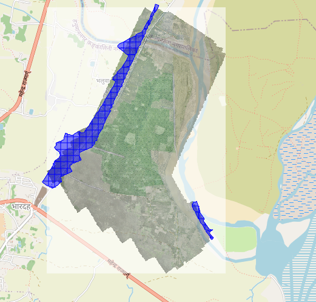

# Flood Segmentation

## Overview

My initial approach, after reading the problem statement, was to convert the TIF images into smaller JPG tiles and manually annotate or mask them using Roboflow to fine-tune a YOLO segmentation model.After Understanding about Instance segmentation and semantic segmentation and knowing yolo will not work for this, I thought of using U-Net instead of YOLO for segmentation. However, after converting the TIF images to JPG, I ended up with many white images. After removing these white images, there were still over 3,000 images remaining, making it impractical to manually annotate and fine-tune a model in two days.  

Therefore, I decided to generate **NDWI-based water masks** for all pre-flood and post-flood satellite tiles.

-----
### NDWI (Normalized Difference Water Index)


NDWI = Green - NIR / Green + NIR

**Pixel classification:**  
- Water pixel → NDWI > threshold (0.1)  
- Land pixel → NDWI ≤ threshold  

**Workflow:**  
1. Read each tile from pre-flood and post-flood folders.  
2. Compute NDWI using the Green (Band 2) and NIR (Band 4) bands.  
3. Convert NDWI to a binary mask (1 = water, 0 = land).  
4. Save the mask as a GeoTIFF while preserving georeferencing.  
5. Visualize results using Folium maps.  


# Why NDWI didn't work

### NDWI Flood Mask
  

NDWI is designed to detect clean, blue water using the difference between the Green and NIR bands.
It assumes that:

1. Water reflects strongly in the Green band

2. Water absorbs almost everything in the NIR band

**This makes NDWI very effective for clear rivers, lakes, and ponds.**

**However, floodwater is usually muddy and brown, especially in agricultural or riverine areas. muddy water increase NIR reflectance, making the floodwater appear more like land in the NDWI formula. so Flooded areas go undetected**

## Area and Centroids Calculation

- **area_m2**:calculated this by converting each polygon to a projected coordinate system (UTM Zone 45N — EPSG:32645), where units are in meters. This ensures accurate area measurement.

- **Centroids**: computed the geometric centroid of each polygon and then converted the coordinates back to WGS84 (EPSG:4326) to produce the final longitude and latitude values.  

## CSV Output

The exported CSV contains the following columns:

| Column          | Description |
|-----------------|-------------|
| `centroid_lat`  | Latitude of polygon centroid (WGS84) |
| `centroid_lon`  | Longitude of polygon centroid (WGS84) |
| `area_m2`       | Polygon area in square meters |
| `geometry_wkt`  | Polygon geometry in WKT format |

--------

This CSV provides **flood polygon locations, areas, and geometry**,
Open the flood map by clicking [flood_overlay_map.html](Map_view/flood_overlay_map.html) in your browser  

I Stored **geometry_wkt** to keep the exact polygon shapes in text form, so they can be used later for analysis or visualization while keeping the CSV readable.

**area_lost_m2**, **pre_flood_land_image**, and **post_flood_land_image** were not included in the CSV because the method used (NDWI) is not suitable for detecting muddy or brown floodwater, so these values were not calculated. A more accurate approach would involve using spectral indices designed for turbid/muddy water, or applying deep learning segmentation on RGB/NIR imagery.

-------

# Files and Folders

| File / Folder                  | Description                                                                 |
|--------------------------------|----------------------------------------------------------------------------|
| `flood_geojson_for_map/`       | Contains GeoJSON files used to create Folium maps of flooded areas.        |
| `JPG_image_data/`              | Contains JPG images of TIFF files in smaller ZIP files for easy handling.  |
| `Map_view/`                    | Contains HTML files for interactive viewing of the flood map.           |
| `Masked_TIF/`                   | It contains masked TIFF file(s) representing flood areas.           |
| `change_tif_to_image.py`       | Python script to convert TIFF files to images (e.g., PNG or JPG).         |
| `flood_overlay.png`            | Sample overlay image of flood polygons on the base map.                   |
| `flood_polygons.csv`           | CSV file with polygon centroids, areas, and geometry of flood regions.    |
| `Flood_Segmentation.ipynb`     | Jupyter Notebook containing the full flood segmentation workflow.         |
| `readme.md`                     | README file explaining the dataset, workflow, and instructions.           |
| `requirements.txt`             | List of Python dependencies needed to run the scripts and notebook.       |
| `WhiteImageRemove.py`          | Python script for preprocessing, e.g., removing blank/white images.       |

  
**To reconstruct the original ZIP file, use the following command:**

```bash
cat flood_data.zip.part-* > flood_data.zip